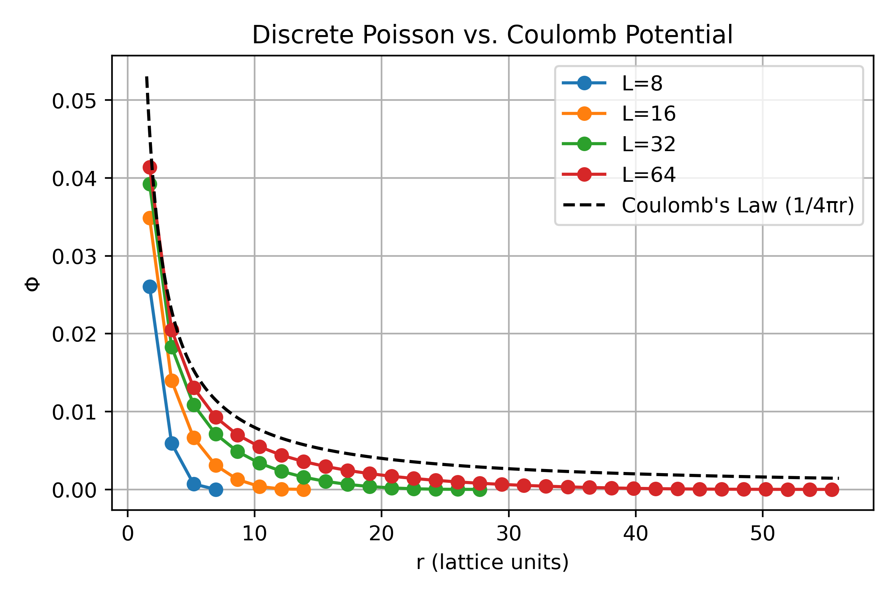

HW 3 - 3D Poisson Equation on a Lattice
---

## Assignment Brief

This assignment aims to solve the **3D Poisson equation** on a **cubic lattice** using the **Jacobi iterative method**.

This corresponds to the discrete form of the Poisson equation:

$$
\nabla^2 \Phi = -\rho
$$

with charge distribution:

$$
\rho_{i,j,k} = \begin{cases}
1, & \text{if } (i,j,k) = \left(\frac{L}{2}, \frac{L}{2}, \frac{L}{2}\right) \\
0, & \text{otherwise}
\end{cases}
$$

The solution is updated iteratively using the **Jacobi method** with grid spacing ( $h = 1$ ). At each iteration, the interior potential is updated by:

$$
\Phi_{i,j,k}^{n+1} = \frac{1}{6} \left( \Phi_{i+1,j,k}^n + \Phi_{i-1,j,k}^n + \Phi_{i,j+1,k}^n + \Phi_{i,j-1,k}^n + \Phi_{i,j,k+1}^n + \Phi_{i,j,k-1}^n \right) + \frac{1}{6} \rho_{i,j,k}
$$

Iterations continue until convergence, defined by:

$$
\left\| \Phi^{n+1} - \Phi^n \right\| < 10^{-10}
$$

## Methodology
I begin by implementing a **CPU-based version** of the Jacobi method as a **performance baseline**. This version also serves as the **ground truth** for validating GPU results through point-wise comparison.

To accelerate computation, I implement a **GPU version** using CUDA. To avoid **race conditions** during the computation of the global error—where values from all threads must be summed—I use **shared memory** within each thread block to perform partial reductions, followed by a final global accumulation.

Simulations are conducted for cube sizes ( $L = 8, 16, 32, 64$ ). After convergence, the potential is sampled as a function of distance ( $r$ ) from the point charge. The results are then compared against the theoretical behavior predicted by **Coulomb’s law**.

This allows us to examine whether the discrete numerical solution approaches the continuous limit as ( $L \to \infty$ ).

## Experiment Results

### Correctness Verification
Each GPU result is verified against the **CPU ground truth** by performing element-wise comparison. All values satisfy the condition:

$$
\left| \Phi_{i,j,k}^{\text{CPU}} - \Phi_{i,j,k}^{\text{GPU}} \right| < 10^{-6}, \quad \forall i, j, k
$$

This confirms that the GPU implementations produce **numerically accurate results** under all configurations tested.

### Comparison with Coulomb potential
I compares the numerical solution of the discrete Poisson equation with the theoretical Coulomb potential ( $\Phi \propto \frac{1}{r}$ ). The results for different grid sizes ( $L = 8, 16, 32, 64$ ) are plotted along the diagonal direction. As $L$ increases, the numerical potential approaches the theoretical curve, indicating convergence toward the continuous limit. The singular point at $r = 0$ is excluded from the plot to improve clarity.

### CPU vs. GPU

| Environment | L  | Time (ms)     | Speed-up |
|-------------|----|---------------|----------|
| CPU         | 8  | 0.324         | 1.00×    |
| GPU         | 8  | 4.951         | 0.07×    |
| CPU         | 16 | 12.009        | 1.00×    |
| GPU         | 16 | 17.307        | 0.69×    |
| CPU         | 32 | 388.823       | 1.00×    |
| GPU         | 32 | 122.988       | 3.16×    |
| CPU         | 64 | 12634.901     | 1.00×    |
| GPU         | 64 | 1769.699      | 7.14×    |
