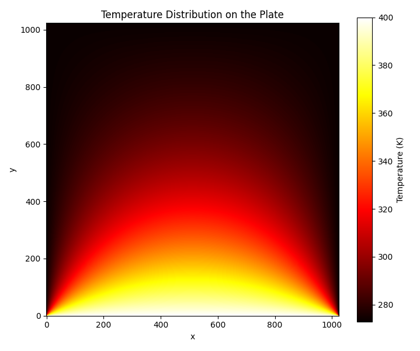

HW 5 - Heat Diffusion with Multi-GPU and P2P Access
---

## Assignment Brief
Implement and benchmark a program to solve the **heat diffusion problem** on a **Cartesian grid** using **multi-GPU parallelism with P2P (peer-to-peer) memory access**.

The goal is to compute the **thermal equilibrium temperature distribution** on a square plate with the following boundary conditions:
- Square place: (1024, 1024)
- Top edge: 400 K
- All other edges: 273 K

This is equivalent to solving the **Laplace equation** in two dimensions until equilibrium is reached:

$$
\nabla^2 T = 0
$$

The solution is obtained using **Jacobi iterative method**, with a fixed relaxation factor $\omega = 1$. Test the implementation on **one** and **two GPUs**.

The update rule for each interior grid point follows:

$$
\left| T_{i,j}^{\text{CPU}} - T_{i,j}^{\text{GPU}} \right| < 10^{-6}, \quad \forall i, j
$$

## Methodology
I begin by implementing a **CPU-based version** of the Jacobi method as a **performance baseline**. This version also serves as the **ground truth** for validating GPU results.

Then, I implement two GPU versions for comparison:

**Single-GPU Version**
- The entire 2D grid is processed on a single GPU using global memory.

**Multi-GPU Version**
- The 2D grid is **partitioned along either the X or Y dimension**, with each GPU responsible for a distinct subregion. This strategy allows for **flexible domain decomposition** based on grid shape and device count.
- To synchronize boundary data between GPUs, I enable **peer-to-peer (P2P) access** using `cudaDeviceEnablePeerAccess`, avoiding host memory overhead and improving communication efficiency.

**Block Size**
- To assess kernel performance, I test four different **block sizes** corresponding to square thread blocks: 4×4, 8×8, 16×16, and 32×32.
- Square blocks are selected for their superior **data locality** and **memory efficiency**, as their **lower boundary-to-area ratio** reduces redundant memory accesses and improves shared memory utilization.

## Experiment Results

### Correctness Verification
Each GPU result is verified against the **CPU ground truth** by performing element-wise comparison on the final temperature matrix. All values satisfy the condition:

$$
\left| T_{i,j}^{\text{CPU}} - T_{i,j}^{\text{GPU}} \right| < 10^{-6}, \quad \forall i, j
$$

This confirms that the GPU implementations produce **numerically accurate results** under all configurations tested.

A heatmap of the final temperature distribution is shown below to illustrate the expected steady-state pattern under the given boundary conditions.

### CPU vs. Single GPU vs. Multiple GPU

| Environment | GPU Config | Block Size  | Total Time (ms)  | Speed-up         |
|-------------|------------|-------------|------------------|------------------|
| CPU         | (0, 0)     | –           | 2698642.500      | 1.00× (baseline) |
| GPU         | (1, 1)     | (4, 4)      | 843858.875       | 3.20×            |
| GPU         | (1, 1)     | (8, 8)      | 293606.500       | 9.19×            |
| GPU         | (1, 1)     | (16, 16)    | 240521.234       | 11.22×           |
| GPU         | (1, 1)     | (32, 32)    | 288021.344       | 9.37×            |
| GPU         | (1, 2)     | (4, 4)      | 487500.125       | 5.53×            |
| GPU         | (1, 2)     | (8, 8)      | 171438.328       | 15.74×           |
| GPU         | (1, 2)     | (16, 16)    | 136256.359       | 19.80×           |
| GPU         | (1, 2)     | (32, 32)    | 158973.906       | 16.97×           |
| GPU         | (2, 1)     | (4, 4)      | 410398.469       | 6.58×            |
| GPU         | (2, 1)     | (8, 8)      | 172640.828       | 15.63×           |
| GPU         | (2, 1)     | (16, 16)    | 137397.172       | 19.63×           |
| GPU         | (2, 1)     | (32, 32)    | 158496.953       | 17.01×           |

**Observations**
- **Small Block Sizes (e.g. 4×4) perform poorly** across all configurations. This is expected because the **warp size is 32**, and overly small blocks result in low warp occupancy and underutilized hardware resources.
- The **16×16 block size consistently yields the best performance**, outperforming both smaller and larger blocks. In contrast, **32×32 blocks** likely reduce overall **occupancy**, making it harder to **hide memory stalls**, leading to slightly worse performance.
- **Multi-GPU configurations** (e.g., (1,2) or (2,1)) offer significant speed-up over the single-GPU setup. However, due to **P2P communication overhead**, the speed-up is **sub-linear** and does not reach the ideal 2×. This suggests that while computation scales well, inter-GPU data exchange becomes a limiting factor.
