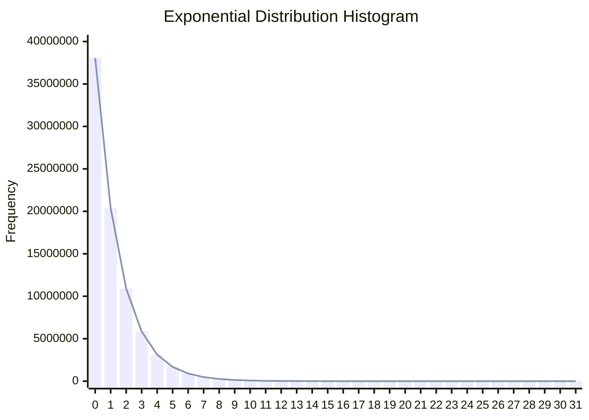
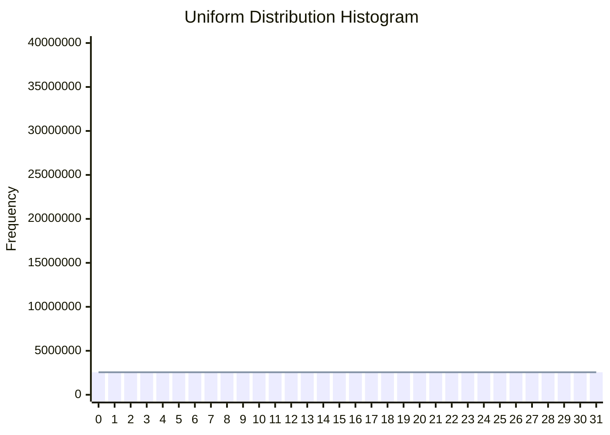

HW 6 – Exponential Distribution Histogram
---

## Assignment Brief
Generate a dataset that follows the **exponential distribution**, and evaluate the performance of computing its **histogram** using different execution models:
- **CPU**
- **GPU using global memory**
- **GPU using shared memory**

The exponential distribution is defined as:

$$
P(x) = \lambda e^{-\lambda x}, \quad x > 0,\ \lambda = 1
$$

The histogram is computed by dividing the range ($[0, x_{\text{max}}]$) into uniform bins of width ($\Delta$). The count for each bin is given by:

$$
\text{bin}_j = \left| \left\\{ a_i \mid a_i \in \left[ j \cdot \Delta, (j+1) \cdot \Delta \right) \right\\} \right|, \quad j = 0, 1, \dots, B-1,\quad a \in \mathbb{R}^{N}, \quad N = 81920000
$$

## Analysis
This assignment compares different implementations of **histogram** computation on an **exponentially distributed dataset**. The core observations are:
- **Global Memory (gmem) Version**: The GPU version using global memory suffers from a large number of **race conditions**, since all threads update the same global histogram bins concurrently.
- **Shared Memory (smem) Version**: To reduce race conditions, the shared memory version assigns each thread block a **private histogram in shared memory**. These partial histograms are later combined into the global histogram, significantly reducing write contention, though race conditions can still occur during the final reduction.
- **Vectorized Access on smem Version**: I further implement a vectorized version of the shared memory approach. This reduces the **number of memory load instructions** (e.g., using `float4` instead of `float`), but **does not improve memory coalescing**, as the original implementation already achieves coalesced accesses within a warp.

## Experiment Results

### Histogram Verification
To verify correctness, we compare the computed histogram with the theoretical shape of the exponential / uniform distribution:

**Theoretical Probability Calculation for the Exponential Distribution**

Each bin ($i$) corresponds to the range ($[b_i, b_{i+1}]$), where:

$$
b_i = i \cdot \Delta, \quad b_{i+1} = (i + 1) \cdot \Delta
$$

The theoretical probability mass for bin ($i$) is given by:

$$
P_i = \int_{b_i}^{b_{i+1}} \lambda e^{-\lambda x} \, dx = e^{-\lambda b_i} - e^{-\lambda b_{i+1}}
$$

Multiplying by the total number of samples $N$, I obtain the expected count for bin ($i$):

$$
\text{Expected Count} = N \cdot \left(e^{-\lambda b_i} - e^{-\lambda b_{i+1}}\right)
$$

Configuration:

$$
N = 81920000, \quad \text{Range} = 20, \quad \text{Number of Bins} = 32, \quad \Delta = \frac{20}{32}, \quad \lambda = 1
$$

### CPU vs. GPU (Best Case)

I first compare the **end-to-end execution time** across all implementations. 
- GPU versions include data transfer overhead, not just kernel time. 
- Shared memory significantly improves performance by reducing contention, and vectorized access brings additional gains.

> Exponential Distribution: `n_bin = 32, block_size = 128`

| Platform                       | Total Time (ms) | Speed-up         |
|--------------------------------|-----------------|------------------|
| CPU                            | 150.920364      | 1.00× (baseline) |
| GPU + gmem                     | 89.720062       | 1.68×            |
| GPU + smem                     | 59.122242       | 2.55x            |
| GPU + smem + vectorized access | 57.243729       | 2.64x            |

### GPU Kernel

To isolate and evaluate **kernel performance**, I exclude all data transfer and focus solely on GPU compute time. Two types of datasets are used:
1. **Exponential Distribution** (high skew): Most values fall into the first few bins, leading to more frequent atomic updates (i.e., race conditions).
2. **Uniform Distribution (Control Group)**: Introduced as an additional test case to isolate race condition effects. With values evenly distributed across bins, it incurs significantly fewer atomic update conflicts compared to the exponential dataset.

> Exponential Distribution: `n_bin = 32, block_size = 128`

| Platform                       | Compute Time (ms) | Speed-up         |
|--------------------------------|-------------------|------------------|
| GPU + gmem                     | 35.414536         | 1.00× (baseline) |
| GPU + smem                     | 4.813350          | 7.36x            |
| GPU + smem + vectorized access | 2.891782          | 12.25x           |

> Uniform Distribution: `n_bin = 32, block_size = 128`

| Platform                       | Compute Time (ms) | Speed-up         |
|--------------------------------|-------------------|------------------|
| GPU + gmem                     | 31.221088         | 1.00× (baseline) |
| GPU + smem                     | 4.361181          | 7.16x            |
| GPU + smem + vectorized access | 1.982726          | 15.75x           |

**Observations**
- **Uniform vs. Exponential**: Across all implementations, the uniform dataset consistently outperforms exponential, confirming that **race conditions degrade performance**.
- **Shared Memory Optimization**: Using shared memory dramatically reduces kernel time by minimizing atomic conflicts at the global memory level.
- **Vectorized Access**: Surprisingly, vectorized versions show a **1.7x–2.2x speed-up** over shared-memory kernels.
  - Histogram workloads are typically memory-bound and low in compute intensity, so this improvement is **not** likely from instruction throughput.
  - Since memory accesses are already coalesced within a warp in both versions, **memory transaction efficiency** should be similar.
  - A possible explanation is reduced **index arithmetic overhead**: vectorized code computes indices once per `float4`, instead of per `float` element. This is speculative and not yet confirmed.
